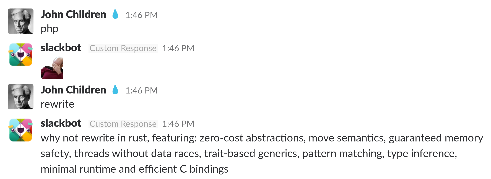

## What is Slack?

IRC for hipsters with gifs.

- picture of slack and describe what it is
- talk about chat interface

## What is a bot

- describe bots

<div class = "notes">

sample notes

- note 1
- note 2

</div>

## Motivation

I spend a lot of time on Slack so anything that makes it more enjoyable is good.
 set scene more

## Custom Responses



## Problems

- Very inflexible, just match one of several phrases.
- More annoying than intented as they can happen in any channel.

## Custom Bots

- Join channels only on invitation.
- Can have silly names.
- Are able to process messages however you want.

add image of robot?

## DavidHunt {.shrink}

~~~ python
import time
import slackclient


client = slackClient(token=API_TOKEN)
client.rtm_connect()


while True:
    davidHunt = client.rtm_read()
    for lead in davidHunt:
        # filter out non-message payloads
        if lead.get("type") != "message":
            continue

        channel = lead["channel"]

        msg_lead = lead.get("text", "")
        if "david" in msg_text:
            reply = "Whoops! Didn't you mean @duncan?"
            client.rtm_send_message(channel, reply)
    time.sleep(1)
~~~

describe scenario
show functionality not code
break into 3 or 4 slides
show bot first

## RTM API

- Explain how it works
more inclusive language

## Retrospective

remove this one
- Pretty basic but it means we can control what channel the reponses happen in.
- Can be turned on and off by just running the bot on a personal machine.
- Potentially could be deployed to AWS easily if needed. 

## Quotes

more gifs
``` python
import random

QUOTES = ["something silly", "something equally silly"]

reply = random.choice(QUOTES)
```

## Retrospective

lets amp it up
- Now we can do everything custom responses can do.
- Still quite limited in what we can do.
- Let's do something slackbot can't.


## SlackBot Library

- Gives us better modular structure for these features.
- Lets us create a single bot that is more easily managed.
- Single features can be expressed as functions with decorators.

## Real or Not Real

logic diagram
not funny
shopping list
logic diagram
~~~ python
@respond_to("is (.*) a real number", re.IGNORECASE)
def real_or_not_real(message, number):
    try:
        message.reply(
            'yes, {} is a real number'
                .format(float(number)))
    except:
        message.reply(
            'no, {} is not a real number'
                .format(number))
~~~

## Party Mode

## Markov Chains

- (explaination of some kind)

## Markov chains in python

``` python
import markovify

model = markovify.Text(text, 3)

message.send(model.make_sentence())
```

## Corpus

Let's make it cultured. Collect text files for:

- The Bible
- Complete works of Shakespeare
- Every Sherlock Holmes

## Mistakes were made

"If this be error and upon social questions
    which I am Misanthropos, and hate mankind."
                ~ MarkovBot


## Better Corpus ?

- Collect script for every episode of Seinfeld via requests library.
- Find all of Jerry's lines and strip off his name.
- Use them to build the corpus.
- Throw in the entire Bee Movie script for good measure.

## Results

- "He's nice, bit of a surprise to me."
- "You're gonna take this kid to the top."
- "I'm just a little bee!"

## Slash Commands

- Markov Chains are cool but not very interactive.
- We could do the same thing with a slash command.
- But: We don't want to just handle raw requests ourselves!

## Linklater

- Haskell library for interacting with slack apis.
- Supports both rtm clients and slash commands.

##


##


## Ideas for more annoying bots

- Insult generation and delivery
- Just writes the word "Buzz" after a random period.
- Direct messages everything you tweet to your colleagues.
- Sends 3 laugh till crying emojis everytime someone says "lol".
- Pings people if you spell their name approximately correctly.

## Ideas for helpful bots

- Welcomes new starters to a channel and sends resources.
- Voting on pubs (you can even do AV!).
- Execute arbitrary embedded code snippets (good luck).
- Randomize lunch venues.
