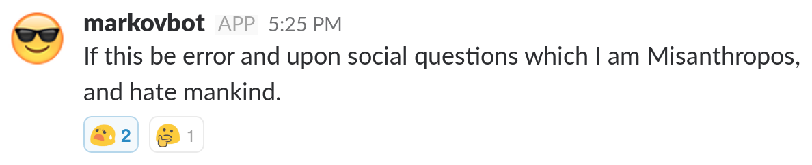

## Who am I?

. . .

Software engineer at InfoSum.

. . .

Broadly a ployglot when it comes to programming.

. . .

Maker of annoying bots.

::: notes
(read slides)

Now I know I was advertised as a Haskell man, but any code in this
presentation will be in Python, sorry to disappoint.
:::

## What is Slack?

Web based team messaging platform to allow for easier group communication.

::: notes
(read slides)
:::

------------

It's a communication program.

::: notes
What is Slack?

It's a communication program

You may be particularly familiar with slack if you have joined the Basingstoke tech scene slack.
:::

------------


::: notes
In case you haven't seen slack, this is what it looks like.

There a bunch of channels you can join and talk in, or you can message people directly.

And as you can see in the image I'm just talking to myself.
:::

------------


::: notes
So, moving on, what is a Bot?

If you enter "Bot" into DuckDuckGo this is the first image

But this isn't the kind of Bot this presentation is about.
:::

------------


::: notes
When you join a Slack team you will be greeted by a user named "slackbot".

This bot acts like a regular user, but is omnipresent.

What can we do with this default bot?
:::

------------


::: notes
One thing you can do is add custom responses which are triggered whenever a message appears in any channel containing a keyword or one of many keywords.

As you can see, we have a few programming related custom responses on the company slack in order to boost morale.

It's quite straight forward to add custom responses to slackbot, which can all be done in the web UI, but there are a few problems with custom responses.
:::

## Problems

- Very inflexible, just match one of several phrases.
- More annoying than intended as they can happen in any channel.

::: notes
So how can we deal with these problems? Fortunately Slack, being a modern web API, has an API and great support for custom bots.
:::

## Custom Bots

- Join channels only on invitation.
- Can have silly names.
- Are able to process messages however you want.

::: notes
What are custom bots? Essentially they are just small client programs that can act like regular users.

But they have a few advantages over the default slackbot

(read slides)
:::

------------

::: notes
So why did we start using bots with slack? Well that's requires a short story.

We run small in office projects as part of our interview process and unfortunately
one day there was a miscommunication about one of the candidate's names.

This resulted in poor David being addressed as Duncan by one of the team which he graciously just ignored without making a fuss.

Anyway we decided to offer a job to David and he accepted but people weren't keen to forget the mistake.
:::

------------


::: notes
And one day one of my colleagues, Johan, brought this toy in to work.

Essentially any time someone was to say "david" this bot would correct them.

So how does this work?
:::

------------

``` python
client = slackClient(token=API_TOKEN)
client.rtm_connect()
```

::: notes
We connect to the RTM API.

RTM standards for real time messaging API.

Essentially your bot client will periodically ask slack if anything
has happened and it will send back all the events since it last asked.

But we need an API token to login which we get from the slack  website.

Fortunately you can't just add a bot without logging in.
:::

------------

``` python
while True:
    davidHunt = client.rtm_read()
```

::: notes
Here we define an infinite loop that constantly reads from the client.
:::

------------

``` python
for lead in davidHunt:
    # filter out non-message payloads
    if lead.get("type") != "message":
        continue
```
::: notes
We can get a bunch of different responses from the server,
but we only care about messages.

If it's not a message we just continue to the next response.
:::

------------

``` python
channel = lead["channel"]

msg_lead = lead.get("text", "")
if "david" in msg_text:
    reply = "Whoops! Didn't you mean @duncan?"
    client.rtm_send_message(channel, reply)
```

::: notes
We want to respond in the same channel, so we get that from the response.

We check every message if it contains the word david and if it does
we correct them with duncan.

Handily we had set up a group already that would notify david whenever
someone mentions duncan so he will get two notifications.
:::

------------

``` python
time.sleep(1)
```

::: notes
Then we just wait for a second before we query the server again.

But these few slides are all you need to implement a basic slackbot.
:::

------------

Obviously the invention of DuncanBot lead to a bot arms race.

::: notes
(read slides)
:::

## Quotes

``` python
QUOTES = ["something silly", "something equally silly"]

reply = random.choice(QUOTES)
```

::: notes
This snippet just gives us the ability to chose random responses.

Now we can do everything that custom responses from slackbot can.
But we now have all of the python ecosystem to control how how we interact.

But we can go further...
:::

## Markov Chains

"A Markov chain is a type of Markov process that has either discrete state space or discrete index set" -[Wikipedia][Markov_chain]

[Markov_chain]: https://en.wikipedia.org/wiki/Markov_chain

::: notes
Markov chains have a lot of uses in a variety of fields, but one cool thing
you can do with them is generate random text that almost looks like English.
:::

## General Case

$$\mathbb{P}(X_t \in A |\mathcal{F}_s) = \mathbb{P}(X_t \in A| X_s).$$

::: notes
If you do take a look at Markov chains on wikipedia you will see a lot of
equations like this describing their properties.

Essentially all that matters to us though is their use in text generation.

Here they pick a random word based on what words have already been generated.
:::

## Markov chains in python

``` python
import markovify

model = markovify.Text(text, 3)

message.send(model.make_sentence())
```

::: notes
Now here's how you implement it in python.

The hardest part here is reading many files into a string and then concatenating
them to make your corpus.

The 3 just means that it considers up to the previous 3 words when generating the next.
:::

## Corpus

Let's make it cultured. Collect text files for:

- The Bible
- Complete works of Shakespeare
- Every Sherlock Holmes

::: notes
What you get out therefore depends on what you put in.

Let's put in some cultured works to get a cultured bot.
:::

------------



::: notes
This is an entirely original quote, but even though we know
how this bot worked, we decided to bring it down and re-educate it.
:::

## Better Corpus ?

. . .

- Collect script for every episode of Seinfeld via requests library.

. . .

- Find all of Jerry's lines and strip off his name.

. . .

- Use them to build the corpus.

. . .

- Throw in the entire Bee Movie script for good measure.

::: notes
In order to entertain we need a comedian, and who is funnier than 90's comedian Jerry Seinfeld?

So...

(read slides)
:::

------------


::: notes
This is technically correct.
:::

------------


::: notes
Unfortunately you do get a lot of nonsense.
:::

------------


::: notes
And a lot of ominous phrases.

You can also see the Seinfeld influence here though and
one alternative is to download your teams entire slack history
and build a markov chain generator from that, which will
make them sound like a regular employee!

So I set up the Markov text generation to trigger randomly
whenever someone wrote a message in our #random channel.

But this was deemed too annoying.
:::

## SlackBot Library

- Gives us better modular structure for these features.
- Lets us create a single bot that is more easily managed.
- Single features can be expressed as functions with decorators.

::: notes
So we got to the point where we had a few custom bots running in
our slack team. But this seemed a bit wasteful so I started using
the slackbot library.

This library makes it really easy to make modular bots that
provide a lot of functionality.
:::

## Decorators

``` python
@respond_to("is (.*) a real number", re.IGNORECASE)
def real_or_not_real(message, number):
```

::: notes
Here's an example from an older bot, we can match a regular expression
and just handle all messages that match it.

And we can speak only when spoken to.

Anyway we managed to use this to unify all our bots into a single one.
:::

## Ideas for more annoying bots

------------

Just writes the word "Buzz" after a random period.

::: notes
Raw annoyance, but will probably not last a long time.
:::

------------

Direct messages everything you tweet to your colleagues.

::: notes
This one requires a bit more effort, you will need to make use of the twitter API to check your tweets periodically, but is certainly on the annoying side.
:::

------------

Sends 3 laugh till crying emojis every-time someone says "lol".

::: notes
Potentially a good way to train people to avoid that phrase.

Very annoying.
:::

------------

Pings people if you spell their name approximately correctly.

::: notes
Finally, this one requires a bit more work as you will need to do fuzzy string matching against the names of people currently online. Potentially very annoying for people whose names are similar to common words if you get the sensitivity wrong.

Potentially also helpful if you keep misspelling people's names though.
:::

## Ideas for helpful bots

------------

Welcome new starters to a channel and send resources.

::: notes
Pretty common way of using bots in slack. Very boring.
:::

------------

Randomize lunch venues.

::: notes
Somewhat indecisive? You can have a bot that picks a random place for you to have lunch. Bonus points for making it less likely to pick places you ate at recently.
:::

------------

Voting on pubs!

::: notes
Often it's hard to decide which pub to attend first. With this kind of bot you can vote in secret and then get a result and you can even implement alternative vote!
:::

------------

Execute arbitrary embedded code snippets (good luck).

::: notes
If you are a programmer it is sometimes useful to show off code to colleagues and have it evaluate. While slack supports code snippets you could write a bot that runs the code like a REPL.

Much much easier for interpreted languages.
:::

## Thank you

github.com/johnchildren

twitter.com/johnchildren
